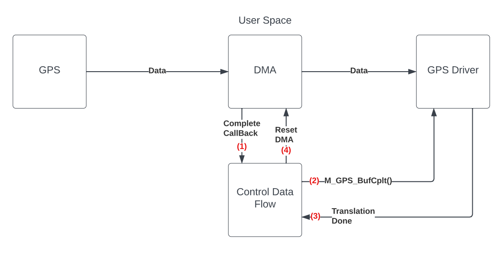
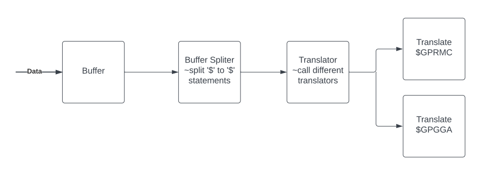
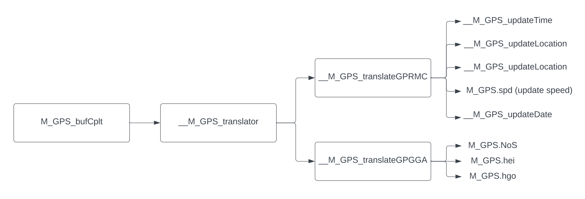

# overview

Features

- Non Stop (DMA + Interrupt)
- Fast
- Easy Usage
- Rich Output
  - Time (+ Local Time)
  - Date
  - Location
  - Height
  - Speed
  - Number Of Satellites

---

# How To Use



```cpp
    M_GPS_init(huart1);
    M_GPS_bufInit(huart1);
```

```cpp
void HAL_UART_RxCpltCallback(UART_HandleTypeDef *huart) {
 if (huart->Instance == USART1) {
  M_GPS_bufCplt();
  M_GPS_bufInit(huart1);
 }
}
```

## Getting Data

datas can be obtained directly from M_GPS structure (for more information read data structure section) or "get function"

```cpp
// get locations
double M_GPS_getLatitude(void);
double M_GPS_getLongitude(void);
double M_GPS_getHeight(void);
double M_GPS_getGeoHeight(void);

// get more information
uint16_t M_GPS_getSpeed(void);
uint8_t M_GPS_getNumberOfSatellites(void);

// get time
void M_GPS_getTimeString(char *str);
uint8_t M_GPS_getHour(void);
uint8_t M_GPS_getMinute(void);
uint8_t M_GPS_getSecond(void);
uint8_t M_GPS_getMilliSecond(void);

// get date
void M_GPS_getDateString(char *str);
uint8_t M_GPS_getDay(void);
uint8_t M_GPS_getMon(void);
uint8_t M_GPS_getYear(void);
```

# Data Structure

> M_GPS
>
>> lat (latitude)
>>
>> lon (longitude)
>>
>> hei (height)
>>
>> hgo (height of geoid)
>>
>> NoS (number of satellites)
>>
>> spd (speed)
>>
>> time
>>> hur (hour)
>>>
>>> min (minute)
>>>
>>> sec (second)
>>>
>>> msc (millisecond)
>>
>> date
>>> yar (year)
>>>
>>> mon (month)
>>>
>>> day (day)

```cpp
struct __M_GPS_Time{
 uint8_t hur; // hour
 uint8_t min; // minute
 uint8_t sec; // second
 uint8_t msc; // millisecond
};

struct __M_GPS_Date{
 uint8_t yar; // year
 uint8_t mon; // month
 uint8_t day; // day
};

struct {
 double lat;  // latitude
 double lon;  // longitude

 double hei;  // height
 double hgo;  // height of geoid

 uint8_t NoS; // number of satellites
 uint16_t spd; // speed

 struct __M_GPS_Time time;
 struct __M_GPS_Date date;
} M_GPS;
```

# How It Works





# PCB  

**This part is under designing! (previous design with some problems is available in V1 Branch**

