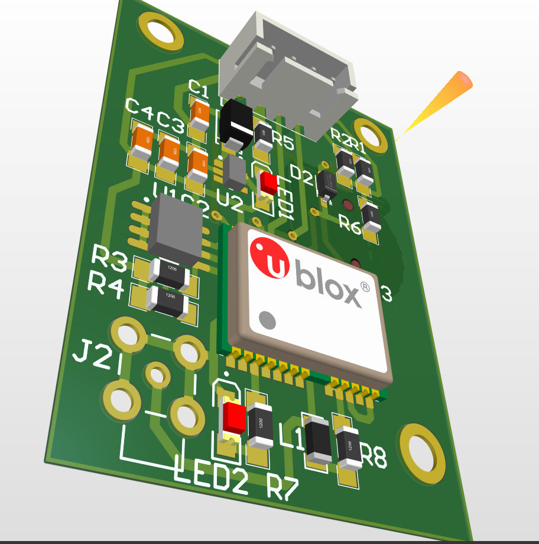

<h2>init</h2>
you should change parameters in the header file

UART_HandleTypeDef <code>huart2</code>;
DMA_HandleTypeDef <code>hdma_usart2_rx</code>;

#define UART <code>huart2</code>
#define UART_T <code>USART2</code>

and of course, #include <hal...> 
like
#include <code>"stm32f1xx_hal.h"</code>

<h2>usage</h2>
<h4><code>GPSInit(void);</code></h4>
you should call this function to start receiving data from GPS with DMA

after call this function send a byte data to GPS to GPS module start send data to micro
like: 
<code>
  uint8_t M = 1;
   
  HAL_UART_Transmit(&huart1, &M, 1, 10);
</code>

<h4><code>float GPSLocationN(void)</code></h4>
<h4><code>float GPSLocationE(void)</code></h4>
location in float format

<h4><code>uint8_t GPSHour(void)</code></h4>
<h4><code>uint8_t GPSMinute(void)</code></h4>
<h4><code>uint8_t GPSSecond(void)</code></h4>
clock of GPS in uint8_t(byte) format

#-----------------------------------------------------
<h4>example</h4>
find necessary codes with search <code>//<----------</code>

#-----------------------------------------------------
PCB

